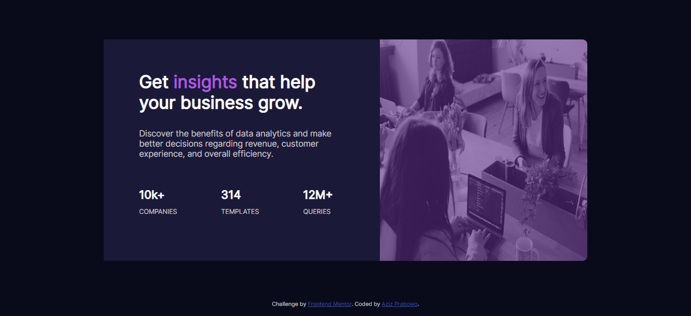

# Frontend Mentor - Stats preview card component solution

This is a solution to the [Stats preview card component challenge on Frontend Mentor](https://www.frontendmentor.io/challenges/stats-preview-card-component-8JqbgoU62). Frontend Mentor challenges help you improve your coding skills by building realistic projects.

## Table of contents

- [Overview](#overview)
  - [The challenge](#the-challenge)
  - [Screenshot](#screenshot)
  - [Links](#links)
- [My process](#my-process)
  - [Built with](#built-with)
  - [What I learned](#what-i-learned)
- [Author](#author)

## Overview

### The challenge

Users should be able to:

- View the optimal layout depending on their device's screen size


### Screenshot



### Links

- Solution URL: [SOLUTION](https://www.frontendmentor.io/solutions/responsive-stats-preview-card-using-css-grid-o3u5LSXhUd)
- Live Site URL: [LIVE SITE](https://azizp128.github.io/stats-preview-card)

## My process

### Built with

- Semantic HTML5 markup
- CSS custom properties
- Flexbox
- CSS Grid
- Mobile-first workflow

### What I learned

I learned CSS Grid, CSS custom properties & Mobile-firstt workflow in this challenge.

To see how you can add code snippets, see below:

```css
:root {
  --clr-primary-main-background: hsl(233, 47%, 7%);
  --clr-primary-card-background: hsl(244, 38%, 16%);
  --clr-primary-accent: hsl(277, 64%, 61%);
  --clr-neutral-main-heading-stats: hsl(0, 0%, 100%);
  --clr-neutral-main-paragraph: hsl(0, 0%, 100%, 0.75);
  --clr-neutral-stat-heading: hsl(0, 0%, 100%, 0.6);
  --fnt-inter: "Inter", Courier, monospace;
  --fnt-lexend: "Lexend Deca", Courier, monospace;
}
```

```css
.card-details {
  text-align: initial;
  margin: 40px;
  padding-left: 30px;
  display: grid;
  overflow-y: auto;
  grid-template-areas:
    "title title title"
    "cap cap cap"
    "card-stat-1 card-stat-2 card-stat-3";
  grid-template-columns: 1fr 1fr 1fr;
  grid-template-rows: 0fr 0.6fr;
}
```

## Author

- Frontend Mentor - [@azizp128](https://www.frontendmentor.io/profile/azizp128)
- Twitter - [@azizprbw](https://www.twitter.com/azizprbw)
